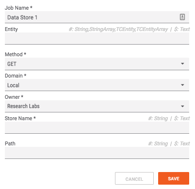
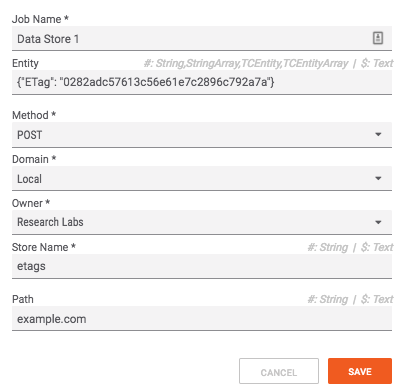

# Introduction to the Datastore

## Datastore Structure

When working with the datastore, I think of it like a file system with three levels:

`/{domain}/{store name}/{path}`

The datastore Playbook app provides a field for each of these levels:

If you are trying to retrieve content from the datastore, you can leave the `entity` field empty; if you are trying to write/update content, put the new data in the `entity` field as valid json. For example, if you wanted to record the value of the [ETag](https://en.wikipedia.org/wiki/HTTP_ETag) of a domain, the datastore app would look something like:

