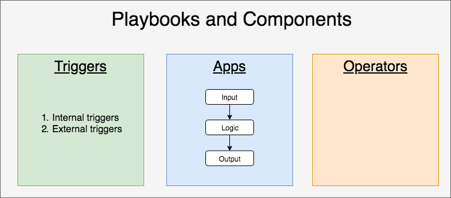

# Definitions

When learning playbooks, there are a few important definitions and classifications to keep in mind. On this page, we're going to start at a high level and work our way down.

## Playbooks and Components

There are two 'things' that can be created. **Playbooks** and **components**.

On a basic level, **Playbooks** capture a process made up of smaller operations. **Components** are similar to playbooks in that they are made up of smaller operations; the main differences between components and playbooks are:

- A component can only be started from a playbook or other component (they aren't accessible to the outside world like a playbook)
- Components are designed to capture useful processes that may be used in multiple other playbooks and other components. In this sense, components are like functions or methods in computer programming.

You can read more about components [here](https://kb.threatconnect.com/customer/portal/articles/2927890).

## Tiggers, Apps, and Operators: Parts of a Playbook/Component

If we were to zoom in on a specific playbook or component, that playbook/component would be made up of smaller steps. Those steps would fall into one of three types:

1. Triggers - these start a playbook/component (a component has a specific type of trigger)
2. Apps - these typically take input, perform an action, and provide some output
3. Operators - these provide functional capabilities like comparisons and [merge](../constructs/merge-operator)

Here is a helpful picture detailing these basic classifications:

## Blue and Orange

All playbook apps have two possible output paths. One is blue and one in orange. Execution is passed along the orange line if the app fails. It is passed along the blue line if the app executes successfully.
